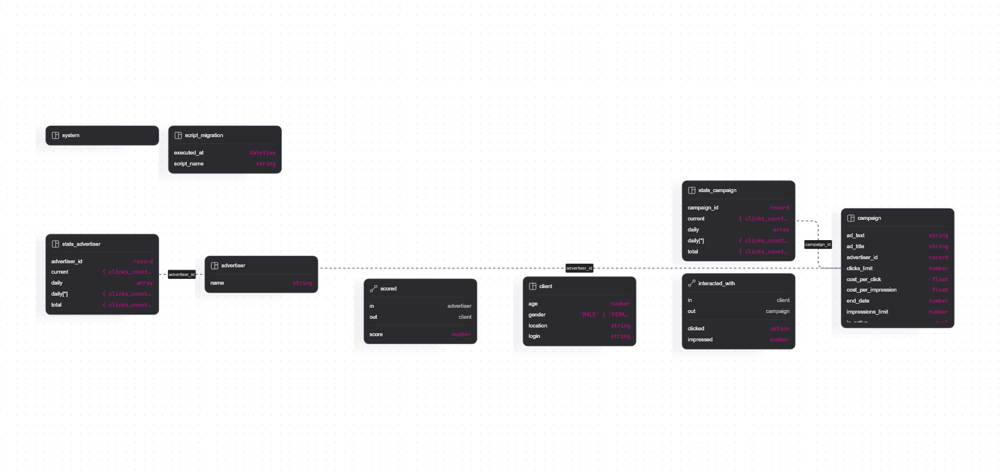

# PROD Backend 2025 Рекламная платформа 

## Использованные технологии: 
- Rust. Обеспечивает выявление практически всех ошибок ещё на этапе компиляции проекта и высокую скорость работы.
- Actix-web. Один из самых быстрых web фреймворков для Rust. 
- SurrealDB. Мультимодальная NoSQL база данных. За счёт своих особенностей сильно упрощает разработку.
- Grafana. Удобное ПО для визуализации данных
- MinIO. Лёгое S3-совместимое хранилище файлов. Один из лучших бесплатных вариантов.
- Teloxide. Декларативный фреймворк для написания Telegram-ботов на Rust. 
- Docker и Docker compose. Наиболее популярное решение для разворачивания различных программ без пробелм с совместимостью.
- Nix. Пакетный менеджер/функциональный язык программирования. Экосистема вокруг него позволяет быстро создавать окружения для разработки, гарантируя отсутствие конфликитов между пакетами.

## Инструкция по запуску:
1. Установить Docker на свою ОС. Инструкция по установке - https://docs.docker.com/desktop/
2. Выполнить команду `docker compose up --build -d` и дождаться её завершения.

## Развёртка окружения для разработки:
1. Установить Docker. (см. п.1 в инструкции по запуску)
2. Выполнить команду `docker compose -f ./dev-compose.yml up -d`
### Если на вашей ОС установлен Nix, то можете использовать его:
3. Активировать окружение для разработки
Команда для Nix 3: `nix develop`
Команда для Nix 2: `nix-shell`
Если помимо Nix 3 у вас есть direnv и nix direnv, то можете прописать `direnw allow`.

### В остальных случаях:
3. Установить Rust и Cargo: `curl --proto '=https' --tlsv1.2 -sSf https://sh.rustup.rs | sh` на Unix-подобных системах и `https://static.rust-lang.org/rustup/dist/i686-pc-windows-gnu/rustup-init.exe` на Windows
4. (необязательно, но очень полезно) Установить cargo-watch и surealdb-migrations: `cargo install cargo-watch` и `cargo install surrealdb-migrations`

## Схема данных СУБД:

## OpenApi:

